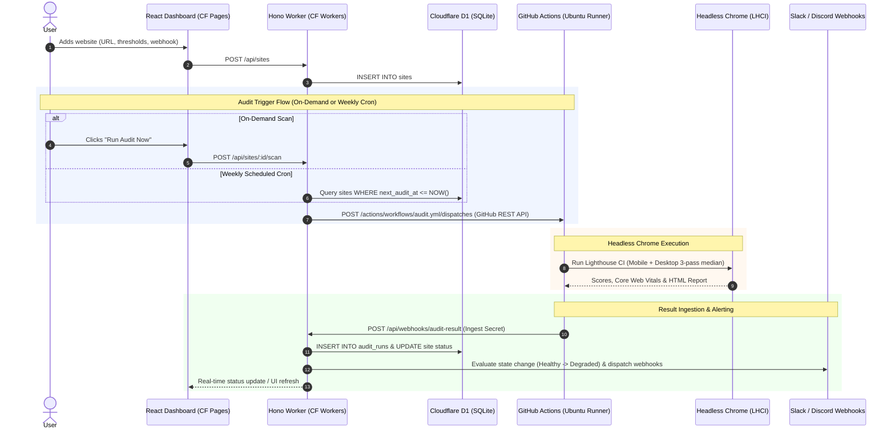
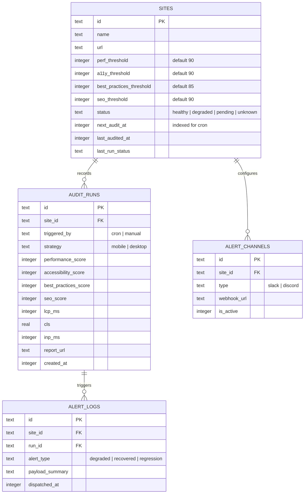

# Mantiscan — System Design Specification
**Automated Lighthouse CI Audit & Alerting (Choice A: Cloudflare Dashboard + GitHub Actions Runner)**

---

## 1. Executive Summary & Problem Definition

**Mantiscan** is a hybrid website performance and accessibility monitoring system:
* **The Frontend & API:** A modern web dashboard hosted on **Cloudflare Pages + Workers + D1** where users can input client website URLs, configure threshold red-lines, set up team alert channels (Slack/Discord), inspect historical score trends, and trigger on-demand audits.
* **The Audit Runner:** An asynchronous headless browser worker hosted on **GitHub Actions** (2 vCPUs, 7GB RAM Ubuntu runner) that executes official **Google Lighthouse CI (`@lhci/cli`)** with headless Chrome across **Mobile** and **Desktop** viewports, eliminates CPU jitter with multi-run median scores, generates interactive HTML reports, and posts results back to the Cloudflare API.

The entire architecture is engineered for a **$0 operational budget** and provides a real web UI without requiring paid background servers.

---

## 2. End-to-End System Architecture

---

## 3. Component Breakdown

### A. Frontend Web Dashboard (`apps/web`)
* **Host:** Cloudflare Pages (React + Vite SPA).
* **Styling & Aesthetics:** Dark mode default, glassmorphism card surfaces, vibrant SVG radial gauges (Green $\ge 90$, Orange $50-89$, Red $<50$), responsive layout.
* **Key Views:**
  * **Dashboard Overview:** Monitored sites list, health status badges (`healthy`, `degraded`), latest scores, last audited timestamp.
  * **Add / Edit Site Modal:** Input site name, URL, custom thresholds (Performance, A11y, Best Practices, SEO), and Slack/Discord webhook URLs.
  * **Site Detail Page:** Mobile vs Desktop score tabs, Core Web Vitals cards (LCP, CLS, INP, FCP, TTFB), historical score trend sparkline, and direct link to the full Lighthouse HTML report.
  * **"Run Audit Now" Button:** Triggers on-demand scan with real-time polling state ("Queued on GitHub Actions...", "Running Lighthouse...", "Completed").

### B. Backend API & Database (`apps/api`)
* **Host:** Cloudflare Workers (Hono TypeScript API + native Cron Trigger) bound to Cloudflare D1.
* **Key Endpoints:**
  * `GET /api/sites`: List all monitored sites.
  * `POST /api/sites`: Create a site with thresholds and alert webhooks.
  * `GET /api/sites/:id`: Site details with latest audit runs.
  * `DELETE /api/sites/:id`: Remove site.
  * `POST /api/sites/:id/scan`: Triggers GitHub Actions workflow via `api.github.com/repos/{owner}/{repo}/actions/workflows/audit.yml/dispatches`.
  * `POST /api/webhooks/audit-result`: Ingestion endpoint called by GitHub Actions runner, authenticated via `X-Ingest-Secret`.
* **Scheduled Cron:** Hourly `scheduled()` event checks for sites due for weekly audit and dispatches GitHub workflow runs.

### C. GitHub Actions Runner (`.github/workflows/audit.yml`)
* **Runner Environment:** `ubuntu-latest` (2 vCPUs, 7GB RAM).
* **Inputs:** `site_id`, `url`, `name`, `strategies` (default: "mobile,desktop").
* **Steps:**
  1. Checkout code & setup Node.js.
  2. Run Lighthouse CI (`@lhci/cli autorun`) using headless Chrome.
  3. Upload full HTML reports as GitHub Actions artifacts.
  4. Parse `.lighthouseci/manifest.json`.
  5. Post metrics, scores, and report artifact link back to Cloudflare API `POST /api/webhooks/audit-result`.

---

## 4. Data Model (Cloudflare D1 + Drizzle ORM)

---

## 5. Alerting & Notification Engine

* **State Machine:**
  * `Healthy ➔ Degraded`: Dispatches **Degradation Alert** to Slack / Discord with red accent.
  * `Degraded ➔ Healthy`: Dispatches **Recovery Alert** with green accent.
  * Score drop $\ge 10$ points: Dispatches **Regression Warning** with amber accent.
  * `Degraded ➔ Degraded (no delta)`: Suppressed to prevent alert fatigue.
* **Slack Payload:** Formatted Block Kit with status emoji, mobile/desktop breakdown, Core Web Vitals, and direct link to the HTML report.
* **Discord Payload:** Rich Embed with color bars matching audit health.

---

## 6. Closed-Loop Local Development & Testing (Carmack Principles)

You can run and verify the entire system on your Mac without deploying to Cloudflare or waiting for GitHub Actions:
1. **Local D1 & Hono:** `npx wrangler dev` runs the API with local SQLite.
2. **Local Dashboard:** `npm run dev` in `apps/web` launches the Vite dashboard on `http://localhost:5173`.
3. **Local Runner Mode:** In local development, clicking "Run Audit Now" or running `npm run audit:local` can execute Lighthouse headless Chrome directly on your machine or inject mock fixtures to verify UI updates and Slack alerts instantly!
