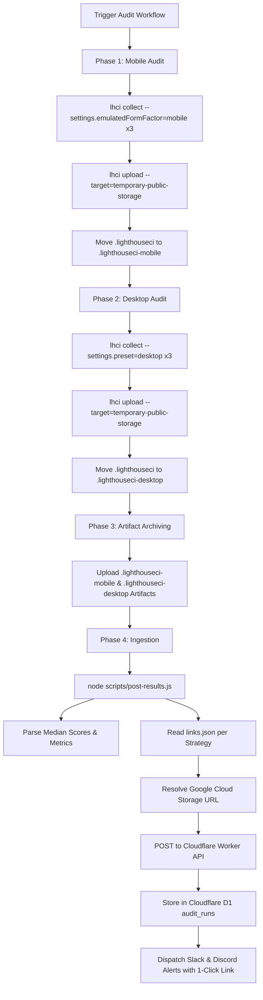

# Mantiscan — Interactive Lighthouse HTML Report Hosting Specification
**Zero-Credit-Card Ephemeral Cloud Diagnostics via LHCI Temporary Public Storage**

---

## 1. Executive Summary & Purpose

In Mantiscan, when an automated or on-demand audit finishes, users inspect their results via the web dashboard and alert notifications (Slack and Discord). Previously, the link titled **"View Full Interactive Lighthouse Report"** pointed directly to the raw GitHub Actions run summary page (`https://github.com/.../actions/runs/...`).

This required users to:
1. Authenticate with GitHub.
2. Download a compressed `.zip` artifact.
3. Extract the artifact locally.
4. Manually open `.html` files in their browser.

This broke the primary diagnostic loop: when an alert warns of a score regression or Core Web Vitals degradation, users need immediate, 1-click access to Google Lighthouse's rich DOM diagnostic, filmstrip, and treemap.

This specification details the architecture, execution pipeline, and verification model to provide **real 1-click interactive HTML report hosting** with **$0 operational budget** and **zero credit card requirement**, utilizing Google Lighthouse CI's native `temporary-public-storage` within the GitHub Actions runner.

---

## 2. Understanding Summary & Key Constraints

* **What is being built:** Automated 1-click interactive HTML report generation and hosting for both Mobile and Desktop audits, replacing raw GitHub Actions artifact zip links.
* **Why it exists:** To close the diagnostic feedback loop so users can inspect root-cause performance regressions instantly from web and chat alerts.
* **Who it is for:** Developers, performance engineers, and site owners monitoring website health.
* **Core Constraints:**
  * **$0 Operational Budget & Zero Billing Setup:** Must not require credit card entry (eliminating Cloudflare R2 and AWS S3).
  * **Zero Extra Moving Parts:** No dedicated self-hosted LHCI server, no separate third-party vendor accounts or token management.
  * **Zero Git History Bloat:** Must not commit 800KB+ HTML files into git history (rejecting GitHub Pages branch commits).
* **Explicit Non-Goals:**
  * Permanent multi-year storage of heavy raw HTML files (Cloudflare D1 already stores historical scores, timestamps, and CWV telemetry permanently).
  * Custom domain vanity URLs for the temporary report views.

---

## 3. Assumptions & Non-Functional Requirements (NFRs)

1. **Retention & Ephemeral Staging:** Reports are stored on Google's public staging infrastructure (`storage.googleapis.com`) with a 7–14 day lifespan. This matches the standard CI performance debugging window.
2. **Strategy Segregation:** Mobile and Desktop viewports must produce independent median HTML reports so users can inspect viewport-specific issues.
3. **Resilience & Fallback:** If `lhci upload` encounters a network glitch or timeout, the workflow must not fail; the ingestion script falls back to the GitHub Actions run URL.
4. **Security & Privacy:** Report URLs are publicly accessible via high-entropy unguessable hashes. Audited targets are public URLs.
5. **Runner Overhead:** Adding the upload step adds less than 5 seconds to total GitHub Actions execution time.

---

## 4. Decision Log

| Decision | Alternatives Considered | Rationale |
| :--- | :--- | :--- |
| **Use Google LHCI `temporary-public-storage`** | Cloudflare R2, AndroidFileHost, GitHub Pages, Supabase Storage | Cloudflare R2 requires credit card verification; AndroidFileHost lacks an upload API and does not serve web pages; GitHub Pages bloats git history and suffers from concurrency race conditions; Supabase adds unnecessary third-party account overhead. Google's temporary storage is built into `@lhci/cli`, requires no credit card, and has zero configuration. |
| **Sequential Viewport Execution & Directory Isolation** | Unified directory upload, custom Node HTTP uploader | `@lhci/cli` hardcodes `.lighthouseci/` and groups by target URL. Running Mobile and Desktop in sequence with isolated directories guarantees independent median calculation and unique report URLs. |
| **Direct `links.json` File Ingestion** | Regex scraping of CLI stdout | `lhci upload` writes a deterministic `links.json` mapping file. Reading this file in Node is resilient, fast, and eliminates brittle stdout regex parsing. |
| **Zero Database Migrations** | Adding custom report fields | The `audit_runs` table already stores a `report_url text` column per strategy run. Zero D1 migration is needed. |
| **Non-Blocking Upload & Graceful Fallback** | Failing the audit run on upload failure | Audit scores and alerts must never be dropped because of a secondary report upload timeout. Falling back to the GHA run URL preserves end-to-end alerting reliability. |
| **Redirect-Resilient Link Resolution** | Strict key matching on `inputs.url` | Target sites often redirect (e.g. `http` $\to$ `https` or non-www $\to$ www). Inspecting both requested URL, final URL, and first link value ensures redirect targets always resolve their report. |

---

## 5. System Architecture & Execution Flow



### 5.1 Workflow Configuration (`.github/workflows/audit.yml`)

1. **Mobile Execution & Upload:**
   ```bash
   lhci collect --url="${{ inputs.url }}" --numberOfRuns=3 \
     --settings.onlyCategories=performance,accessibility,best-practices,seo \
     --settings.maxWaitForLoad=30000 \
     --settings.chromeFlags="--headless=new --no-sandbox --disable-dev-shm-usage --disable-blink-features=AutomationControlled --disable-extensions --disable-background-networking" \
     --settings.emulatedFormFactor=mobile --additive

   lhci upload --target=temporary-public-storage || true
   mv .lighthouseci .lighthouseci-mobile
   ```

2. **Desktop Execution & Upload:**
   ```bash
   lhci collect --url="${{ inputs.url }}" --numberOfRuns=3 \
     --settings.onlyCategories=performance,accessibility,best-practices,seo \
     --settings.maxWaitForLoad=30000 \
     --settings.chromeFlags="--headless=new --no-sandbox --disable-dev-shm-usage --disable-blink-features=AutomationControlled --disable-extensions --disable-background-networking" \
     --settings.preset=desktop --additive

   lhci upload --target=temporary-public-storage || true
   mv .lighthouseci .lighthouseci-desktop
   ```

3. **Artifact Upload:**
   Upload both `.lighthouseci-mobile` and `.lighthouseci-desktop` to maintain offline zip backups in GitHub Actions.

---

### 5.2 Result Ingestion Script (`scripts/post-results.js`)

The ingestion script processes both strategy directories:

```javascript
function resolveReportUrl(strategyDir, targetUrl, fallbackUrl) {
  const linksPath = path.join(strategyDir, 'links.json');
  if (fs.existsSync(linksPath)) {
    try {
      const links = JSON.parse(fs.readFileSync(linksPath, 'utf8'));
      if (links[targetUrl]) return links[targetUrl];
      const firstUrl = Object.values(links)[0];
      if (firstUrl) return firstUrl;
    } catch (e) {
      console.warn(`Failed reading links.json for ${strategyDir}:`, e.message);
    }
  }
  return fallbackUrl;
}
```

For each strategy:
- Scores and Core Web Vitals are computed from the median run.
- `reportUrl` is resolved via `resolveReportUrl(strategyDir, targetUrl, fallbackUrl)`.
- The payload is dispatched to the Cloudflare Worker API.

---

### 5.3 UI Touchpoint (`apps/web/src/components/SiteDetailModal.tsx`)

In the site detail modal, the report link includes a subtle badge indicating that interactive reports are retained for 14 days, setting proper user expectations while all historical metrics remain permanent:

```tsx
{selectedRun.reportUrl && (
  <a
    href={selectedRun.reportUrl}
    target="_blank"
    rel="noopener noreferrer"
    className="report-link"
  >
    <span>View Full Interactive Lighthouse Report</span>
    <span className="report-retention-badge">14-day live diagnostic</span>
  </a>
)}
```

---

## 6. Closed-Loop Verification Plan (Carmack Principles)

### 6.1 Automated Unit Tests (`apps/api/tests/report-resolver.test.ts`)
* **Exact Match:** Verify that `resolveReportUrl` returns the Google Cloud Storage link when `links.json` contains the exact target URL.
* **Redirect / Fuzzy Match:** Verify that if the audited domain redirects and `links.json` keys by final URL, the first valid link is resolved.
* **Upload Failure Fallback:** Verify that if `links.json` is missing or corrupted, the resolver cleanly returns the GitHub Actions fallback URL.
* **Legacy Directory Compatibility:** Verify that legacy runs with only `.lighthouseci` parse without breaking.

### 6.2 Closed-Loop Manual Verification
1. Run `node scripts/run-audit-local.js --siteId=<id>` with mock report URLs to verify API ingestion and D1 storage.
2. Launch Vite frontend (`npm run dev:web`), open the site detail modal, and confirm the link opens in a new tab with `target="_blank" rel="noopener noreferrer"`.
3. Verify that Mobile and Desktop strategy tabs toggle between their respective report URLs.
4. Execute full project build (`npm run build && npm test`) to ensure clean compilation.
