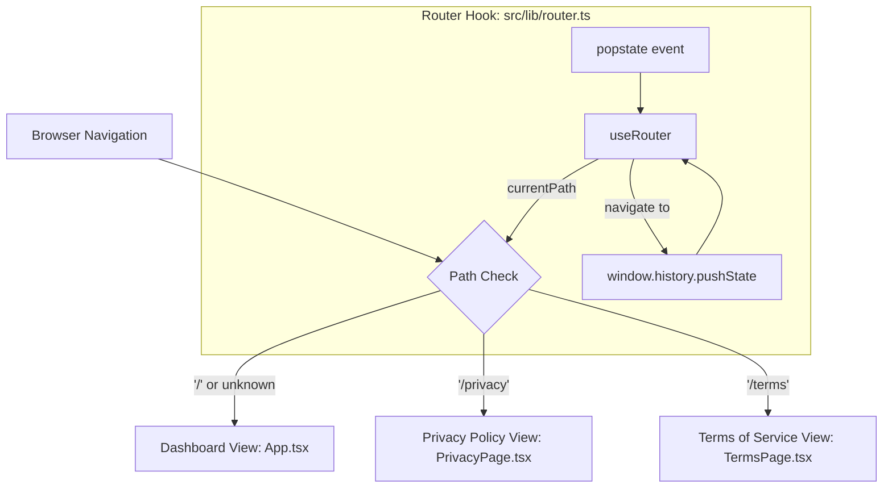

# Mantiscan — Privacy Policy & Terms of Service Specification

**Specification Document:** `docs/specs/privacy-and-tos.md`  
**Status:** Approved  
**Author:** AI Pair Programmer & Project Maintainer  
**Date:** 2026-09-12  

---

## 1. Executive Summary & Purpose

Mantiscan is an automated Lighthouse CI performance & accessibility monitoring platform. To support public demo and production SaaS deployments, this specification defines the architectural and content design for two dedicated, publicly accessible legal views:
1. **Privacy Policy (`/privacy`):** An accurate, zero-marketing-tracking disclosure detailing the exact data lifecycle (monitored URLs, audit metrics, Lighthouse HTML reports, webhook targets, and Cloudflare edge logs).
2. **Terms of Service & Acceptable Use Policy (`/terms`):** Terms governing automated headless Chrome scans, requiring users to hold authorization for scanned targets, disclaiming target server load/performance liabilities, and detailing service limitations.

Both pages are integrated directly into the `apps/web` Vite + React SPA using a lightweight, zero-dependency client router hook, accompanied by global footer links and a submission disclaimer inside the "Add Website" modal.

---

## 2. Understanding Summary

* **What is being built:** Dedicated, publicly routable `/privacy` and `/terms` page views in `apps/web`, linked from the global footer and referenced by legal notice copy directly inside the "Add Website" modal.
* **Why it exists:** Legal risk mitigation, service disclaimers, and acceptable use boundaries for a publicly accessible demo/SaaS, specifically governing third-party URL audits, webhook dispatching, and audit result storage.
* **Who it is for:** Public visitors, open-source evaluators, and users submitting websites to be monitored by Mantiscan.
* **Key constraints:**
  * Must match Mantiscan’s dark-mode glassmorphic design system and responsive layout.
  * Must work within the existing Vite + React SPA architecture without introducing bloated routing dependencies.
  * Must maintain Cloudflare Pages SPA deep-linking compatibility (via `_redirects`).
* **Explicit non-goals:**
  * No cookie banner or consent management tool (Mantiscan sets no tracking or marketing cookies).
  * No mandatory checkbox gate that slows down adding sites.
  * No user account or billing terms (deferred until auth/payments are actually introduced).

---

## 3. Assumptions & Risk Analysis

### Assumptions
* **Routing:** Lightweight, zero-dependency client-side routing based on `window.location.pathname` and `popstate` events is preferred over adding external router packages.
* **Content Source:** Static, version-controlled React view components (easy to maintain, zero network latency, styled with existing CSS tokens).
* **Contact Entity:** Defaults to Mantiscan Open Source / Project Maintainer contact (`support@mantiscan.dev` or GitHub repository issues) with clear placeholders.
* **Hosting Configuration:** Cloudflare Pages `_redirects` will route `/*` to `/index.html` (SPA fallback) while preserving API reverse-proxy rules.

### Key Risks & Mitigations
1. **The "Boilerplate Fallacy":**
   * *Risk:* Copying standard SaaS legal templates with references to passwords, credit cards, or marketing pixels exposes the project to false misrepresentation claims.
   * *Mitigation:* The legal documents are written from scratch to match Mantiscan's actual code and infrastructure realities.
2. **Headless Browser & SSRF Abuse:**
   * *Risk:* External users may attempt to use Mantiscan to audit internal networks (e.g. `http://localhost`, `169.254.169.254`) or denial-of-service targets.
   * *Mitigation:* Acceptable Use Policy clearly forbids scanning unauthorized domains, internal IPs, or load-testing third-party infrastructure, coupled with clear disclaimers of liability.

---

## 4. Decision Log

| # | Decision | Alternatives Considered | Rationale |
|---|---|---|---|
| **D1** | Scope legal text strictly to Mantiscan's actual architecture (audits, headless browser, webhooks, edge logs). | Generic SaaS template (accounts, Stripe, marketing cookies). | Avoids false legal misrepresentations and focuses on actual real-world liabilities (unauthorized target scans, AUP). |
| **D2** | Public demo / SaaS deployment context. | Internal team tool, Agency white-label. | Establishes public disclaimers, AUP, and limitation of liability for external visitors. |
| **D3** | Dedicated routed views (`/privacy`, `/terms`). | Overlay modals, static HTML files. | Enables direct shareable URLs for compliance/directories while preserving app design system. |
| **D4** | Submission notice text in Add Site modal. | Mandatory clickwrap checkbox, passive footer only. | Balances frictionless demo usage with legally adequate notice under clickwrap standards. |
| **D5** | Zero-dependency micro-router hook (`useRouter`) + Cloudflare Pages SPA rewrite. | `react-router-dom`, static HTML files. | Preserves single-page state, 0kB added bundle weight, full browser history support. |
| **D6** | Reusable `LegalLayout` with quick-jump sidebar anchors. | Plain uninterrupted text wall. | Greatly improves legal readability, scanability, and navigation on both desktop and mobile. |
| **D7** | Graceful fallback to Dashboard for unknown routes. | Generic 404 error screen. | Prevents dead ends and keeps users inside the operational dashboard experience. |

---

## 5. Technical Design Specification

### 5.1 Architecture & Client Routing

#### Flow Diagram


#### Client Router Hook (`apps/web/src/lib/router.ts`)
```typescript
import { useState, useEffect, useCallback } from 'react';

export function useRouter() {
  const [currentPath, setCurrentPath] = useState<string>(() => window.location.pathname);

  useEffect(() => {
    const handlePopState = () => {
      setCurrentPath(window.location.pathname);
    };

    window.addEventListener('popstate', handlePopState);
    return () => window.removeEventListener('popstate', handlePopState);
  }, []);

  const navigate = useCallback((to: string) => {
    if (window.location.pathname !== to) {
      window.history.pushState(null, '', to);
      setCurrentPath(to);
      window.scrollTo(0, 0);
    }
  }, []);

  return { currentPath, navigate };
}
```

#### Cloudflare Pages Rewrite (`apps/web/public/_redirects`)
```text
/api/* https://mantiscan-api.diegosilang.workers.dev/api/:splat 200
/* /index.html 200
```

---

### 5.2 Component Structure

#### 1. `apps/web/src/components/LegalLayout.tsx`
Shared layout wrapper providing:
* Top header bar with "← Back to Dashboard" navigation button and Mantiscan logo badge.
* Last updated timestamp badge.
* Desktop side navigation containing anchor jump links (`#overview`, `#collection`, etc.).
* Main content reading column styled with glassmorphic cards and typography matching Mantiscan's design system.

#### 2. `apps/web/src/pages/PrivacyPage.tsx`
Structured sections:
1. **Overview & Zero-Tracking Guarantee:** Affirmation that Mantiscan does not sell personal data, utilize behavioral advertising cookies, or track users across the web.
2. **Information We Collect:**
   * Target website URLs submitted for monitoring.
   * Lighthouse audit outputs (Performance, Accessibility, SEO, Best Practices scores, Core Web Vitals).
   * HTML report artifacts generated during GitHub Actions audit runs.
   * Webhook URLs (Slack / Discord) provided by users.
   * Standard server logs (IP address, user agent, request timestamps) processed automatically by Cloudflare edge workers.
3. **How We Use Information:** Solely to execute audits, calculate score trends, and dispatch alerts to specified webhooks.
4. **Third-Party Sub-processors:**
   * Cloudflare (hosting, edge computing, D1 database storage).
   * GitHub Actions (headless Chrome execution environment).
   * Slack & Discord (delivery endpoints for configured webhook alerts).
5. **Data Retention & Removal:** Monitored sites and associated audit runs can be deleted via the dashboard interface or by contacting maintainers.
6. **Contact & Queries:** Maintainer contact channel (`support@mantiscan.dev` / GitHub repository issues).

#### 3. `apps/web/src/pages/TermsPage.tsx`
Structured sections:
1. **Acceptance & Service Description:** Scope of the Mantiscan public demo and automated auditing service.
2. **Acceptable Use Policy (AUP):**
   * *Domain Authorization:* Users must own or hold explicit permission to audit submitted target URLs.
   * *Prohibited Activities:* Scanning internal/private IP ranges (RFC 1918, link-local, loopback), using audits to perform Denial of Service (DoS), or attempting to bypass rate limits.
3. **Audit Runner Execution & Rate Limits:** Audits execute asynchronously in cloud environments and may be queued or throttled to prevent resource exhaustion.
4. **Disclaimer of Warranties:** The software is provided "AS-IS" without warranty of any kind. Mantiscan does not warrant that audits will be uninterrupted or error-free.
5. **Limitation of Liability:** In no event shall Mantiscan operators be liable for any target server degradation, bandwidth costs, or consequential damages resulting from audit execution.
6. **Modifications & Governing Law:** Standard terms revision clauses and jurisdiction notes.

---

### 5.3 UI Touchpoints

1. **Global Footer (`apps/web/src/App.tsx`):**
   ```tsx
   <footer className="dashboard-footer">
     <p>Mantiscan — Automated Lighthouse CI &amp; Alerting System</p>
     <div className="footer-links">
       <button onClick={() => navigate('/privacy')}>Privacy Policy</button>
       <span>•</span>
       <button onClick={() => navigate('/terms')}>Terms of Service</button>
     </div>
   </footer>
   ```
2. **Add Website Modal (`apps/web/src/components/AddSiteModal.tsx`):**
   ```tsx
   <p className="modal-disclaimer">
     By adding a website, you confirm you have permission to audit this domain and agree to our{' '}
     <a href="/terms" onClick={(e) => { e.preventDefault(); navigate('/terms'); }}>Terms of Service</a>{' '}
     and{' '}
     <a href="/privacy" onClick={(e) => { e.preventDefault(); navigate('/privacy'); }}>Privacy Policy</a>.
   </p>
   ```

---

## 6. Verification & Testing Plan

### Automated Checks
* **Vitest Suite:**
  * Test `useRouter` hook state transitions and `popstate` event handling.
  * Test that `LegalLayout`, `PrivacyPage`, and `TermsPage` render without errors.
  * Test that `AddSiteModal` renders the legal disclaimer text and links.

### Closed-Loop Manual Verification
1. Start dev server (`npm run dev:web`).
2. Navigate to `http://localhost:5173/privacy` and verify clean rendering of the Privacy Policy.
3. Navigate to `http://localhost:5173/terms` and verify clean rendering of the Terms of Service.
4. Test "← Back to Dashboard" button navigation and browser back/forward buttons.
5. Open "Add Website" modal and verify that the disclaimer copy appears cleanly above the submit button.
6. Verify anchor navigation jumps smoothly to target sections.
